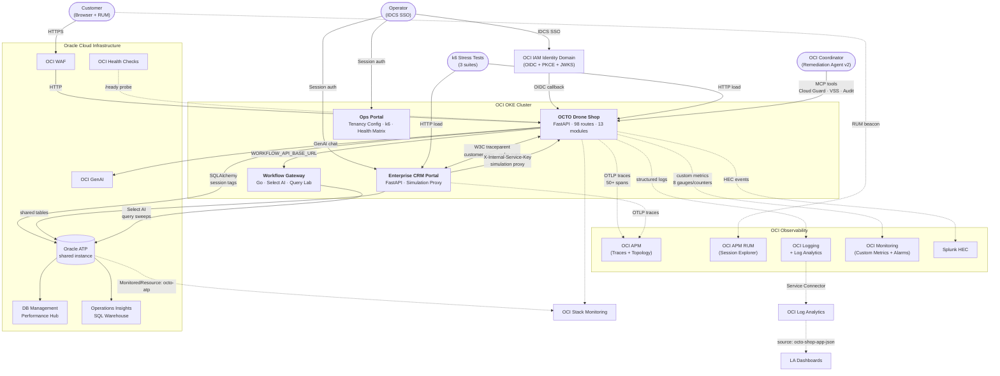

# OCTO Drone Shop Architecture

This document describes the high-level architecture of the OCTO Drone Shop application, its integrations with the Enterprise CRM Portal, OCI Observability services, IDCS SSO, and the OCI Coordinator's Remediation Agent.

## High-Level System Architecture

The OCTO Drone Shop is a cloud-native e-commerce portal built using FastAPI with 98 routes, a Go workflow gateway, IDCS OIDC SSO, and a full OCI observability stack. It operates alongside the `enterprise-crm-portal` and shares an Oracle ATP database. All URLs derive from a single `DNS_DOMAIN` variable for tenancy portability.



## Deployment Bill of Materials

The authoritative minimal set required to redeploy from a blank slate
is enumerated in [`deploy/BOM.md`](deploy/BOM.md). Summary:

| Category | Items | Produced by |
|---|---|---|
| Operator CLIs | oci, kubectl, terraform (≥1.6), docker, envsubst, jq, python3, gh | Laptop one-time setup |
| Tenancy | Tenancy OCID, region, Object Storage namespace, optional remote-state bucket | Console |
| Compartment + IAM | 1 compartment, 2 dynamic groups, ≥1 policy, IDCS domain + app | Console / Terraform |
| Network | VCN + public LB subnet + private worker subnet + IG + NAT GW | Console / Terraform |
| Database | 1 ATP + wallet + admin + wallet password | Console |
| Container registry | 2–3 OCIR repos (shop, CRM, coordinator) | `init-tenancy.sh` |
| Observability | APM Domain, RUM app, 2 data keys, Log group, App log, LA namespace + log group, LA source `octo-shop-app-json`, Service Connector, Stack Monitoring MonitoredResource | `ensure_apm.sh`, `ensure_stack_monitoring.sh`, `tools/create_la_source.py`, Terraform |
| WAF | 4 policies + log group + 4 per-frontend logs | `deploy/terraform/modules/waf` |
| DNS + TLS | 2–4 A records + certs per hostname | Your DNS provider + certbot / OCI Certificates |
| Secrets | 9 (`AUTH_TOKEN_SECRET`, `INTERNAL_SERVICE_KEY`, `APP_SECRET_KEY`, `BOOTSTRAP_ADMIN_PASSWORD`, `ORACLE_PASSWORD`, `ORACLE_WALLET_PASSWORD`, `IDCS_CLIENT_SECRET`, `OCI_APM_PRIVATE_DATAKEY`, `OCI_APM_PUBLIC_DATAKEY`) | `init-tenancy.sh` + OCI Vault (via CSI) |
| Runtime | OKE cluster **or** 1 Compute VM | Console or Terraform |
| Images | shop, CRM, coordinator (optional) | `deploy/deploy.sh` |

Smallest viable deploy (workshop/demo): ~15 minutes from a fresh
tenancy using `deploy/vm/`. Full production deploy: 45–90 minutes first
time, ~15 minutes per subsequent tenancy via the Resource Manager stack.

## Provisioning & portability artifacts

| File | Responsibility |
|---|---|
| `deploy/pre-flight-check.sh` | Fail fast on missing env vars or placeholder leaks before any infra call |
| `deploy/init-tenancy.sh` | Idempotent bootstrap: OCIR repo, K8s namespace, initial `octo-auth`/`octo-atp` Secrets |
| `deploy/terraform/modules/apm_domain/` | APM Domain + RUM Web Application + data keys (outputs) |
| `deploy/terraform/main.tf` (`la_pipeline_app_logs`) | Service Connector: `OCI_LOG_ID` → OCI Log Analytics |
| `deploy/oci/ensure_apm.sh` | Wraps `terraform plan/apply/print` for the APM module |
| `deploy/oci/ensure_stack_monitoring.sh` | Registers ATP as Stack Monitoring `MonitoredResource` |
| `deploy/k8s/secret-provider-class.yaml` | OCI Vault → pod via Secrets Store CSI (template) |
| `deploy/terraform/backend.tf` | OCI Object Storage remote-state stub (commented) |
| `tools/create_la_source.py` | Registers LA source `octo-shop-app-json` + JSON parser |

## Component summary

| Component | Tech | Routes | Key features |
|---|---|---|---|
| Drone Shop | Python/FastAPI | 98 | Commerce, SSO, chaos, observability, CRM sync |
| Workflow Gateway | Go | ~15 | Select AI, query lab, ATP sweeps, component health |
| Enterprise CRM | Python/FastAPI | ~80 | CRM, simulation proxy, SSO, distributed traces |
| Ops Portal | Python/FastAPI | ~40 | Tenancy config, k6 launcher, health matrix, monitoring |
| OCI Coordinator | Python/LangGraph | 10 agents | Remediation Agent v2: detect → correlate → LLM → runbook → approve → execute |

## Testing infrastructure

| Type | Tool | Coverage |
|---|---|---|
| E2E | Playwright | 237 tests × 8 dimensions |
| Load (cross-service) | k6 | 5 scenarios (shop+CRM+ATP+traces) |
| Load (DB stress) | k6 | 6 scenarios (writes, N+1, slow queries, checkout storms) |
| Load (shop-only) | k6 | 4 scenarios (browse, API, geo, security) |
| OCI Health Checks | OCI | HTTP `/ready` every 30s |
| OCI Alarms | OCI Monitoring | 4 alarms (error rate, DB latency, health, CRM sync) |

## Database Entity-Relationship Diagram (ERD)

The Drone Shop application and the Enterprise CRM Portal share the same backend database (Oracle ATP). The following ERD highlights the tables created by the drone shop (`db_init.sql`) and their relationships.

```mermaid
erDiagram
    users {
        int id PK
        string username
        string email
        string password_hash
        string role
        boolean is_active
        datetime last_login
        datetime created_at
    }

    products {
        int id PK
        string name
        string sku
        string description
        float price
        int stock
        string category
        string image_url
        boolean is_active
        datetime created_at
    }

    customers {
        int id PK
        string name
        string email
        string phone
        string company
        string industry
        float revenue
        string notes
        datetime created_at
        datetime updated_at
    }

    orders {
        int id PK
        int customer_id FK
        float total
        string status
        string payment_method
        string payment_status
        string notes
        string shipping_address
        datetime created_at
    }

    order_items {
        int id PK
        int order_id FK
        int product_id FK
        int quantity
        float unit_price
    }

    shops {
        int id PK
        string name
        string address
        string coordinates
        string contact_email
        string contact_phone
        boolean is_active
        datetime created_at
    }

    cart_items {
        int id PK
        string session_id
        int product_id FK
        int quantity
        datetime created_at
    }

    reviews {
        int id PK
        int product_id FK
        int customer_id FK
        int rating
        string comment
        string author_name
        datetime created_at
    }

    coupons {
        int id PK
        string code
        float discount_percent
        float discount_amount
        boolean is_active
        int max_uses
        int used_count
        datetime created_at
    }

    shipments {
        int id PK
        int order_id FK
        string tracking_number
        string carrier
        string status
        string origin_region
        string destination_region
        float weight_kg
        float shipping_cost
        datetime estimated_delivery
        datetime created_at
    }

    warehouses {
        int id PK
        string name
        string region
        string address
        int capacity
        int current_stock
        boolean is_active
        datetime created_at
    }

    campaigns {
        int id PK
        string name
        string campaign_type
        string status
        float budget
        float spent
        string target_audience
        datetime start_date
        datetime end_date
        datetime created_at
    }

    leads {
        int id PK
        int campaign_id FK
        string email
        string name
        string source
        string status
        int score
        string notes
        datetime created_at
    }

    page_views {
        int id PK
        string page
        string visitor_ip
        string visitor_region
        string user_agent
        int load_time_ms
        string referrer
        string session_id
        datetime created_at
    }

    audit_logs {
        int id PK
        int user_id FK
        string action
        string resource
        string details
        string ip_address
        string trace_id
        datetime created_at
    }

    services {
        int id PK
        string name
        string sku
        string description
        float price
        string category
        string image_url
        boolean is_active
        datetime created_at
    }

    tickets {
        int id PK
        int customer_id FK
        string title
        string status
        string priority
        int product_id FK
        int service_id FK
        datetime created_at
        datetime updated_at
    }

    ticket_messages {
        int id PK
        int ticket_id FK
        string sender_type
        string content
        datetime created_at
    }

    %% Relationships
    customers ||--o{ orders : "places"
    orders ||--|{ order_items : "contains"
    products ||--o{ order_items : "included in"

    customers ||--o{ reviews : "writes"
    products ||--o{ reviews : "receives"

    products ||--o{ cart_items : "added to"

    orders ||--o{ shipments : "tracked by"

    campaigns ||--o{ leads : "generates"

    users ||--o{ audit_logs : "performs (optional)"

    customers ||--o{ tickets : "opens"
    products ||--o{ tickets : "related to (optional)"
    services ||--o{ tickets : "related to (optional)"
    tickets ||--|{ ticket_messages : "contains"
```



## Observability v2 overlay

```
End user ──► WAF (DETECT) ──► LB ──► Shop (FastAPI)
                │                     │
                │                     ├─ OTel → APM (trace_id, workflow.id)
                │                     ├─ JSON logs (workflow_id, request_id)
                │                     └─ SQLAlchemy span events (incl. chaos faults)
                │
                └─ WAF events ─┐
                               ▼
                 OCI Logging ──► Service Connector ──► Log Analytics
                                                      │
                               ┌──────────────────────┴──────────────────────┐
                               ▼                                             ▼
         Saved searches (workflow-health, trace-drilldown,        Coordinator MCP tools
         db-slowness-hotspots, waf-vs-app-errors, chaos-vs-organic)  (la_trace_fetch, …)
                               │                                             │
                               ▼                                             ▼
                    Workflow Command Center dashboard          drilldown_pivot node →
                                                               playbook (approval gated)
```

### Chaos control plane

- Control: `CRM /admin/chaos` + Ops portal proxy.
- Store: `chaos_state` table (or Object Storage, configurable).
- Shop: reader only — polls every `CHAOS_STATE_POLL_SECONDS`.
- Faults: injected inside SQLAlchemy `before_cursor_execute` so they
  appear in APM spans as first-class events with `chaos.injected=true`.

### Correlation keys

| key | source | used by |
| --- | --- | --- |
| `trace_id` (`oracleApmTraceId`) | OTel | APM, all logs, Coordinator |
| `request_id` (`X-Request-Id`) | Shop middleware | WAF ↔ app join |
| `workflow_id` / `workflow_step` | Shop middleware | LA dashboards, playbooks |
| `client_ip_hash` | WAF | Security correlation |
