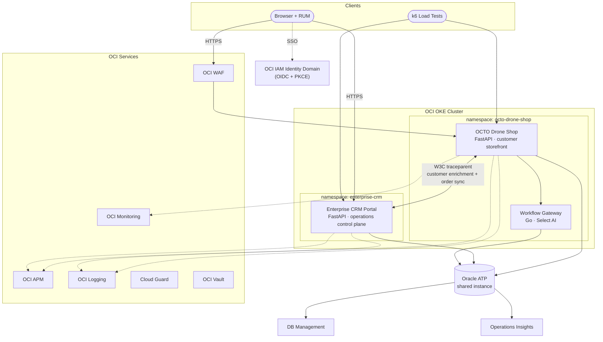

# Platform Overview

The OCTO Cloud-Native Platform consists of two application services sharing a single Oracle ATP database, with full OCI observability stack and cross-service distributed tracing. The current production model uses the shop as the **customer storefront** and the CRM as the **operations control plane** for catalog and storefront changes.

## Platform Components

## Repositories

| Repository | Component | Tech | Purpose |
|---|---|---|---|
| [octo-drone-shop](https://github.com/adibirzu/octo-drone-shop) | Drone Shop + Workflow Gateway | Python/FastAPI + Go | Customer storefront, observability, AI assistant, workflow/query surfaces |
| [enterprise-crm-portal](https://github.com/adibirzu/enterprise-crm-portal) | Enterprise CRM Portal | Python/FastAPI | CRM operations, storefront management, catalog editing, simulation lab |

## Shared Infrastructure

| Resource | Shared By | Purpose |
|---|---|---|
| Oracle ATP | Both services | Single database instance, wallet-based mTLS |
| OCI APM Domain | Both services | Traces, topology, RUM |
| OCI IAM Identity Domain | Both services | OIDC SSO (PKCE + JWKS) |
| OCI Logging | Both services | Structured logs with `oracleApmTraceId` |
| DNS Domain | Both services | `shop.{domain}` + `crm.{domain}` |

## Ownership Boundaries

| Domain | System of Record | Notes |
|---|---|---|
| Product catalog and stock | CRM | Operators edit products, stock, pricing, category, and shop assignment in CRM |
| Storefront metadata | CRM | Shop URLs, CRM public URL linkage, and storefront status are managed from CRM |
| Customer browse/cart/checkout | Shop | Public storefront remains customer-facing only |
| Orders and customer sync | Shared ATP + cross-service sync | Orders originate in shop and are synchronized into CRM workflows |
| Browser-visible CRM links | Public CRM URL | Internal cluster-local CRM hostnames are kept backend-only |

## Design Principles

1. **Shared Data, Independent Services** — Both services read/write the same ATP tables but run in separate K8s namespaces with independent deployments
2. **Observability by Default** — Every HTTP request generates traces, logs, and metrics automatically through shared middleware
3. **Control Plane Separation** — Administrative catalog and storefront changes happen in CRM, not on the public shop frontend
4. **Tenancy Portable** — Single `DNS_DOMAIN` variable configures both services while keeping public and internal URLs separate
5. **Security-Aware** — CRM includes intentional OWASP vulnerabilities for security training; Drone Shop implements production-grade security controls
