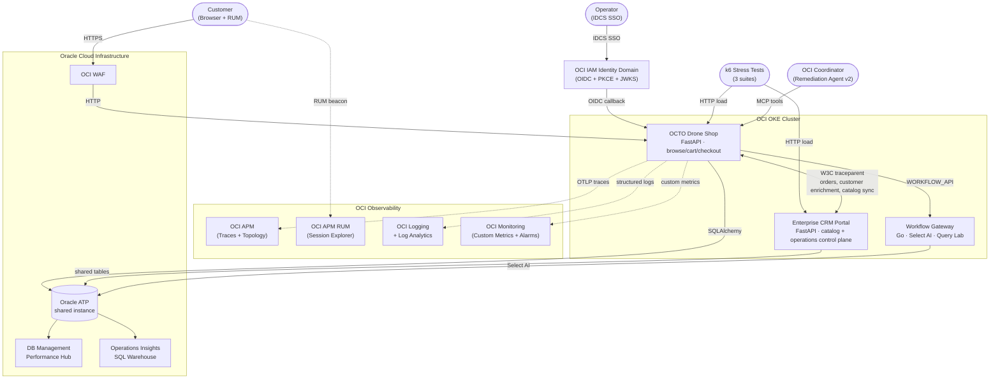

# System Design

## Runtime Topology



## Cross-Service Integration

The Drone Shop and Enterprise CRM Portal communicate via HTTP with automatic W3C `traceparent` header injection. Every cross-service call creates a distributed trace visible in OCI APM Topology.

```
Drone Shop ◄──── W3C traceparent ────► Enterprise CRM
     │                                       │
     │   /api/integrations/crm/*             │
     │   (customer sync, order sync,         │
     │    enrichment, health, catalog sync)  │
     │                                       │
     └─────────► Oracle ATP ◄────────────────┘
                (shared instance)
```

## Operational Ownership

- **Shop** owns customer browsing, cart state, checkout, order origination, and storefront-side observability.
- **CRM** owns customer operations, invoices, support workflows, storefront metadata, and catalog inventory updates.
- **Oracle ATP** remains the shared persistence layer, which is why topology, traces, and SQL drill-down continue to show both services against the same database.
- **Public CRM links** use `CRM_PUBLIC_URL=https://crm.octodemo.cloud`; private cluster-local CRM hostnames are intentionally kept out of browser-facing responses.

### Integration Endpoints

| Endpoint | Direction | Purpose |
|---|---|---|
| `/api/integrations/crm/sync-customers` | Shop → CRM | Pull customers into local DB |
| `/api/integrations/crm/sync-order` | Shop → CRM | Push orders as CRM tickets |
| `/api/integrations/crm/customer-enrichment` | Shop → CRM | Enrich local customer profile |
| `/api/integrations/crm/health` | Shop → CRM | Health check with distributed trace |
| CRM product/shop sync → shop catalog | CRM → Shop | Publish CRM-managed product and storefront changes into the shop |
| Simulation proxy | CRM → Shop | Chaos control via `X-Internal-Service-Key` |

## IDCS SSO Flow

```
Browser → /api/auth/sso/login → IDCS /oauth2/v1/authorize (PKCE S256)
     ◄── redirect with code ──
Browser → /api/auth/sso/callback → IDCS /oauth2/v1/token
     → verify ID token via JWKS (/admin/v1/SigningCert/jwk)
     → upsert local user → issue HMAC bearer token → httpOnly cookie
```

- **PKCE** (S256) prevents authorization code interception
- **JWKS** cached 1 hour with auto-refetch on key rotation
- SSO users auto-provisioned on first login
- Password-based users coexist with SSO users

## APM Topology

When all services are deployed, OCI APM Topology shows:

```
Browser (RUM) → Drone Shop → Oracle ATP
                    ├──→ Enterprise CRM → Oracle ATP
                    └──→ IDCS (SSO login spans)
```

Each edge is a real distributed trace. Clicking an edge in APM Topology shows the specific spans crossing that boundary.
