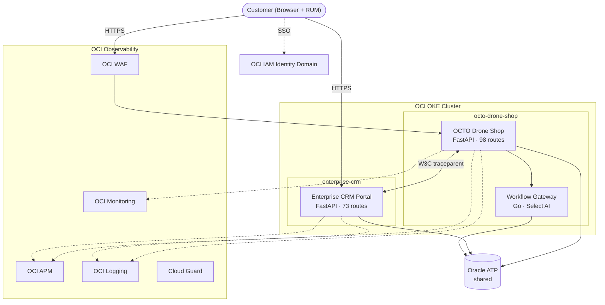

# OCTO Cloud-Native Platform

**Two-service cloud-native platform with shared Oracle ATP, full OCI observability (MELTS), IDCS SSO, cross-service distributed tracing, and automated remediation.**

[:octicons-mark-github-16: Drone Shop](https://github.com/adibirzu/octo-drone-shop){ .md-button .md-button--primary }
[:octicons-mark-github-16: CRM Portal](https://github.com/adibirzu/enterprise-crm-portal){ .md-button .md-button--primary }
[:material-rocket-launch: Live Shop](https://shop.octodemo.cloud){ .md-button }
[:material-rocket-launch: Live CRM](https://crm.octodemo.cloud){ .md-button }

---

## What is OCTO?

The OCTO Cloud-Native Platform is a **two-service architecture** built on Oracle Cloud Infrastructure, demonstrating how enterprise workloads integrate with OCI's observability, security, and AI services.

| Service | Purpose | Routes |
|---|---|---|
| **[OCTO Drone Shop](drone-shop/index.md)** | E-commerce with AI assistant, MELTS observability, security controls | 98 |
| **[Enterprise CRM Portal](crm/index.md)** | CRM with OWASP security training, simulation lab, order sync | 73 |

Both services share a **single Oracle ATP database**, enabling cross-service data correlation and distributed tracing visible in OCI APM Topology.

<div class="grid cards" markdown>

-   :material-telescope:{ .lg .middle } **Modular OCI Observability**

    ---

    APM, RUM, Logging, Log Analytics, Stack Monitoring, DB Management, Ops Insights — each activatable independently as add-ons.

    [:octicons-arrow-right-24: Add-Ons Guide](observability/addons.md)

-   :material-shield-check:{ .lg .middle } **Security-First Design**

    ---

    19 MITRE ATT&CK security span types, WAF protection rules, OCI Cloud Guard, Vault integration, and PII masking.

    [:octicons-arrow-right-24: Security](observability/security.md)

-   :material-puzzle:{ .lg .middle } **Framework Architecture**

    ---

    Modular design with 13 independent modules. Add new features without breaking existing capabilities.

    [:octicons-arrow-right-24: Framework](architecture/framework.md)

-   :material-connection:{ .lg .middle } **Cross-Service Integration**

    ---

    W3C traceparent-propagated distributed traces between Drone Shop, CRM Portal, and shared Oracle ATP.

    [:octicons-arrow-right-24: Integrations](integrations/index.md)

-   :material-database:{ .lg .middle } **Shared Oracle ATP**

    ---

    Single database instance with session tagging, SQL_ID bridging to OPSI, and cross-service data correlation.

    [:octicons-arrow-right-24: Database Integration](architecture/database-integration.md)

-   :material-flask:{ .lg .middle } **Simulation Lab**

    ---

    15+ chaos injection endpoints, cross-service proxy, data generation. Optional security testing add-on for OWASP training.

    [:octicons-arrow-right-24: Simulation](crm/simulation.md)

</div>

## Architecture at a Glance



## Key Capabilities

| Capability | Drone Shop | CRM Portal |
|---|---|---|
| **Routes** | 98 (13 modules) | 73 (12 modules) |
| **Database** | Oracle ATP (shared) | Oracle ATP (shared) |
| **Authentication** | IDCS OIDC + PKCE | IDCS OIDC + PKCE |
| **Traces** | 50+ custom spans | 8+ spans/request |
| **Security** | 19 MITRE ATT&CK types | 24 MITRE ATT&CK types |
| **Testing** | 237 Playwright + 3 k6 | 82 E2E + 3 k6 |
| **Chaos** | SSO-gated simulation | 15+ chaos endpoints |
| **Special** | AI assistant, WAF, Vault | OWASP vulns, order sync |

## Tenancy Portability

Set **one variable** and everything derives:

```bash
export DNS_DOMAIN="yourcompany.cloud"
# → shop.yourcompany.cloud (shop URL, CORS, SSO callback)
# → crm.yourcompany.cloud (CRM URL, customer sync)
# → All IDCS redirect URIs auto-derived
```

No tenancy OCIDs, regions, or hostnames are hardcoded in the codebase.

## OCI-DEMO Components

| ID | Component | Repository |
|---|---|---|
| **C28** | Drone Shop Portal (OKE) | [octo-drone-shop](https://github.com/adibirzu/octo-drone-shop) |
| **C27** | Enterprise CRM Portal (OKE) | [enterprise-crm-portal](https://github.com/adibirzu/enterprise-crm-portal) |

Part of the OCI-DEMO ecosystem alongside Ops Portal and OCI Coordinator with Remediation Agent v2.
