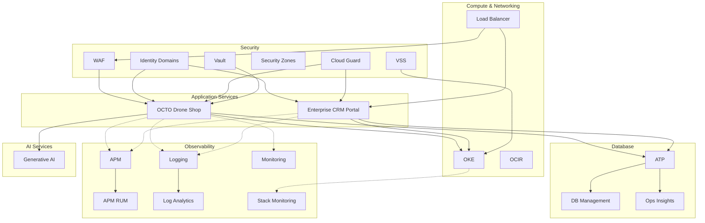

# Introduction

The **OCTO Cloud-Native Platform** is now maintained as a unified
two-service deployment in
[`adibirzu/octo-apm-demo`](https://github.com/adibirzu/octo-apm-demo).
That repository owns the fresh-tenancy workflow, shared Terraform and
Resource Manager stack, Helm chart, OKE manifests, VM deployment, E2E
tests, and operational docs for **both** OCTO Drone Shop and Enterprise
CRM.

This `octo-drone-shop` documentation remains the component reference for
the customer storefront and workflow gateway. If you are provisioning a
new OCI tenancy now, start from the unified project:

[:material-rocket-launch: Unified New Tenancy Guide](https://adibirzu.github.io/octo-apm-demo/getting-started/new-tenancy/){ .md-button .md-button--primary }
[:octicons-mark-github-16: Unified Repo](https://github.com/adibirzu/octo-apm-demo){ .md-button }
[:material-cloud-upload: Deploy Resource Manager Stack](https://cloud.oracle.com/resourcemanager/stacks/create?zipUrl=https://github.com/adibirzu/octo-apm-demo/releases/download/resource-manager-stack/octo-stack.zip){ .md-button }

Use the unified repo for provisioning and this site for Drone Shop
internals, route behavior, observability surfaces, and local component
development.

## Goals

1. **Showcase OCI observability services** — APM, Logging, Monitoring, Log Analytics, DB Management, Operations Insights — as modular add-ons that can be activated independently
2. **Demonstrate cloud-native patterns** — FastAPI + Go microservices, shared Oracle ATP database, IDCS SSO, distributed tracing, circuit breakers
3. **Provide a framework architecture** — add new features without breaking existing capabilities; each module is independent
4. **Enable AI-driven operations** — integration with OCI Coordinator's Remediation Agent v2 for automated detection → diagnosis → remediation
5. **Serve as a reference implementation** — tenancy-portable OKE manifests, security best practices, comprehensive test coverage, and a clear split between public storefront and internal operations control planes

## Architecture Summary

Two application services share a single Oracle ATP database:

| Service | Role | Tech | Routes |
|---|---|---|---|
| [**OCTO Drone Shop**](drone-shop/index.md) | Customer storefront, checkout, AI assistant, observability surfaces | Python/FastAPI + Go | 98 |
| [**Enterprise CRM Portal**](crm/index.md) | CRM operations console, catalog admin, storefront control, simulation lab | Python/FastAPI | ~80 |

Both services integrate with the full OCI observability stack through modular add-ons that activate via environment variables or console configuration — no code changes required.

## Current Runtime Model

- **Canonical deployment repo**: [`adibirzu/octo-apm-demo`](https://github.com/adibirzu/octo-apm-demo)
- **Canonical docs site**: <https://adibirzu.github.io/octo-apm-demo>
- **Default shared deployment hostnames**: `https://shop.cyber-sec.ro` and `https://crm.cyber-sec.ro`
- **Template hostnames for other tenancies**: `https://shop.<your-domain>` and `https://crm.<your-domain>`
- **Shared database**: Oracle ATP
- **Catalog source of truth**: CRM
- **Browser-visible CRM links**: public URL only
- **Backend CRM calls from shop**: may use the internal cluster-local CRM service URL

This split matters operationally: the shop renders customer-facing catalog and checkout experiences, while the CRM is where operators edit customers, orders, invoices, storefronts, and product inventory.

## Provisioning a New Tenancy

Use the unified `octo-apm-demo` repo for new tenancy work. It contains the
current `deploy/bootstrap.sh` flow, Resource Manager package, Helm chart,
cross-service E2E tests, and deployment runbooks.

```bash
git clone https://github.com/adibirzu/octo-apm-demo.git
cd octo-apm-demo
./deploy/verify.sh
```

Recommended fresh-tenancy path:

```bash
OCI_PROFILE=DEFAULT \
OCI_COMPARTMENT_ID=ocid1.compartment.oc1..xxxx \
DNS_BASE_DOMAIN=<your-domain> \
REMOTE_BUILD_HOST=<ssh-host-with-ocir-login> \
./deploy/bootstrap.sh
```

For the shared `DEFAULT` / `oci4cca` profile, the baked-in domain is
`cyber-sec.ro`, so the target hosts are `shop.cyber-sec.ro` and
`crm.cyber-sec.ro`. Check the unified current-status page before treating
that shared environment as E2E-ready:
<https://adibirzu.github.io/octo-apm-demo/operations/current-status/>.

If you prefer the Console-led observability/WAF pre-flight, use the
Resource Manager button above. It provisions tenancy-level observability
and security resources only; it does not create OKE, ATP, DNS, or deploy
the app containers. Use `deploy/bootstrap.sh` for the full end-to-end
application rollout.

## OCI Services

The platform integrates with the following OCI services. Each service is an **independent add-on** — the application runs with or without any given service.

### Core Compute & Networking

| Service | Purpose | Docs |
|---|---|---|
| **Container Engine for Kubernetes (OKE)** | Managed Kubernetes for application hosting | [OKE Documentation](https://docs.oracle.com/en-us/iaas/Content/ContEng/Concepts/contengoverview.htm) |
| **Container Registry (OCIR)** | Private Docker registry for container images | [OCIR Documentation](https://docs.oracle.com/en-us/iaas/Content/Registry/Concepts/registryoverview.htm) |
| **Load Balancer** | HTTP/HTTPS load balancing with TLS termination | [Load Balancer Documentation](https://docs.oracle.com/en-us/iaas/Content/Balance/Concepts/balanceoverview.htm) |
| **Virtual Cloud Network (VCN)** | Network infrastructure with subnets and NSGs | [VCN Documentation](https://docs.oracle.com/en-us/iaas/Content/Network/Concepts/overview.htm) |

### Database

| Service | Purpose | Docs |
|---|---|---|
| **Autonomous Transaction Processing (ATP)** | Oracle Autonomous Database for OLTP workloads | [ATP Documentation](https://docs.oracle.com/en-us/iaas/Content/Database/Concepts/adboverview.htm) |
| **Database Management** | Performance Hub, SQL Monitor, AWR reports | [DB Management Documentation](https://docs.oracle.com/en-us/iaas/database-management/index.html) |
| **Operations Insights** | SQL Warehouse, capacity planning, fleet summary | [Ops Insights Documentation](https://docs.oracle.com/en-us/iaas/operations-insights/index.html) |
| **Select AI** | Natural language queries on ATP | [Select AI Documentation](https://docs.oracle.com/en/database/oracle/oracle-database/23/dbcai/index.html) |

### Observability

| Service | Purpose | Docs |
|---|---|---|
| **Application Performance Monitoring (APM)** | Distributed tracing, service topology, trace explorer | [APM Documentation](https://docs.oracle.com/en-us/iaas/application-performance-monitoring/index.html) |
| **APM Real User Monitoring (RUM)** | Browser performance monitoring, session replay | [APM RUM Documentation](https://docs.oracle.com/en-us/iaas/application-performance-monitoring/doc/real-user-monitoring.html) |
| **Logging** | Structured log ingestion with trace correlation | [Logging Documentation](https://docs.oracle.com/en-us/iaas/Content/Logging/Concepts/loggingoverview.htm) |
| **Logging Analytics (Log Analytics)** | Full-text log search, saved queries, dashboards | [Log Analytics Documentation](https://docs.oracle.com/en-us/iaas/logging-analytics/index.html) |
| **Monitoring** | Custom metrics, alarms, MQL queries | [Monitoring Documentation](https://docs.oracle.com/en-us/iaas/Content/Monitoring/Concepts/monitoringoverview.htm) |
| **Notifications** | Alarm delivery via email, SMS, webhooks | [Notifications Documentation](https://docs.oracle.com/en-us/iaas/Content/Notification/Concepts/notificationoverview.htm) |
| **Health Checks** | HTTP/HTTPS endpoint monitoring | [Health Checks Documentation](https://docs.oracle.com/en-us/iaas/Content/HealthChecks/Concepts/healthchecks.htm) |
| **Stack Monitoring** | Application topology and component health | [Stack Monitoring Documentation](https://docs.oracle.com/en-us/iaas/stack-monitoring/index.html) |

### Security

| Service | Purpose | Docs |
|---|---|---|
| **IAM Identity Domains** | OIDC SSO with PKCE, JWKS verification | [Identity Domains Documentation](https://docs.oracle.com/en-us/iaas/Content/Identity/home.htm) |
| **Web Application Firewall (WAF)** | SQLi/XSS/command injection protection, rate limiting | [WAF Documentation](https://docs.oracle.com/en-us/iaas/Content/WAF/Concepts/overview.htm) |
| **Cloud Guard** | Security posture monitoring, problem detection | [Cloud Guard Documentation](https://docs.oracle.com/en-us/iaas/cloud-guard/home.htm) |
| **Security Zones** | Compliance policy enforcement at compartment level | [Security Zones Documentation](https://docs.oracle.com/en-us/iaas/security-zone/home.htm) |
| **Vault** | HSM-backed secret management and encryption keys | [Vault Documentation](https://docs.oracle.com/en-us/iaas/Content/KeyManagement/home.htm) |
| **Vulnerability Scanning (VSS)** | Host and container vulnerability scanning | [VSS Documentation](https://docs.oracle.com/en-us/iaas/scanning/home.htm) |
| **Audit** | API event audit trail | [Audit Documentation](https://docs.oracle.com/en-us/iaas/Content/Audit/home.htm) |
| **Bastion** | Secure access to private resources | [Bastion Documentation](https://docs.oracle.com/en-us/iaas/Content/Bastion/home.htm) |

### AI & GenAI

| Service | Purpose | Docs |
|---|---|---|
| **Generative AI** | LLM inference for the AI assistant | [Generative AI Documentation](https://docs.oracle.com/en-us/iaas/Content/generative-ai/home.htm) |
| **Generative AI Agents** | Agent orchestration with RAG | [Gen AI Agents Documentation](https://docs.oracle.com/en-us/iaas/Content/generative-ai-agents/home.htm) |

### Integration & Automation

| Service | Purpose | Docs |
|---|---|---|
| **API Gateway** | API management and routing | [API Gateway Documentation](https://docs.oracle.com/en-us/iaas/Content/APIGateway/Concepts/apigatewayoverview.htm) |
| **Resource Manager** | Terraform-based infrastructure-as-code | [Resource Manager Documentation](https://docs.oracle.com/en-us/iaas/Content/ResourceManager/Concepts/resourcemanager.htm) |
| **Events** | Event-driven automation triggers | [Events Documentation](https://docs.oracle.com/en-us/iaas/Content/Events/Concepts/eventsoverview.htm) |
| **Functions** | Serverless compute (FaaS) | [Functions Documentation](https://docs.oracle.com/en-us/iaas/Content/Functions/home.htm) |

## Platform Services Map



## Platform Components

| Component | Service | Cloud Services Used | Description |
|---|---|---|---|
| **Drone Shop** | Python/FastAPI | ATP, APM, RUM, Logging, Monitoring, WAF, Cloud Guard, Vault, IDCS, GenAI | E-commerce storefront with checkout flow, AI assistant, customer-facing catalog, and distributed trace integration into CRM |
| **Workflow Gateway** | Go | ATP, APM, Select AI | Scheduled ATP query sweeps, query lab, Select AI execution |
| **Enterprise CRM** | Python/FastAPI | ATP, APM, RUM, Logging, IDCS | Operational control plane with order sync, storefront management, catalog editing, simulation lab, and OIDC SSO |

## Deployment Options

| Option | Time | Best For |
|---|---|---|
| [Unified new tenancy](https://adibirzu.github.io/octo-apm-demo/getting-started/new-tenancy/) | 45-90 min | Full OCI rollout of Shop + CRM |
| [Deploy to Oracle Cloud](https://cloud.oracle.com/resourcemanager/stacks/create?zipUrl=https://github.com/adibirzu/octo-apm-demo/releases/download/resource-manager-stack/octo-stack.zip) | 5-10 min | Resource Manager pre-flight for APM, RUM, LA, and WAF |
| [Local Docker](getting-started/quickstart.md) | 5 min | Drone Shop component development and testing |
| [Component OKE Deployment](getting-started/oke-deployment.md) | 30 min | Legacy/component-only deployment references |

## Next Steps

- [Unified New Tenancy Guide](https://adibirzu.github.io/octo-apm-demo/getting-started/new-tenancy/) — current end-to-end provisioning path
- [Unified Deployment Options](https://adibirzu.github.io/octo-apm-demo/getting-started/deployment-options/) — OKE, Helm, Resource Manager, VM, and local-stack paths
- [Getting Started](getting-started/index.md) — Drone Shop component prerequisites and local development
- [Architecture](architecture/index.md) — System design, data model, framework approach
- [OCI Observability Add-Ons](observability/addons.md) — 8-level progressive enablement guide
- [Cross-Service Integration](architecture/database-integration.md) — How Drone Shop and CRM share ATP

## Reference Implementations

| Repository | Component |
|---|---|
| [octo-apm-demo](https://github.com/adibirzu/octo-apm-demo) | Unified deployment surface, docs, Resource Manager stack, Helm chart, Terraform, E2E tests |
| [octo-drone-shop](https://github.com/adibirzu/octo-drone-shop) | Drone Shop + Workflow Gateway component source |
| [enterprise-crm-portal](https://github.com/adibirzu/enterprise-crm-portal) | Enterprise CRM Portal |
