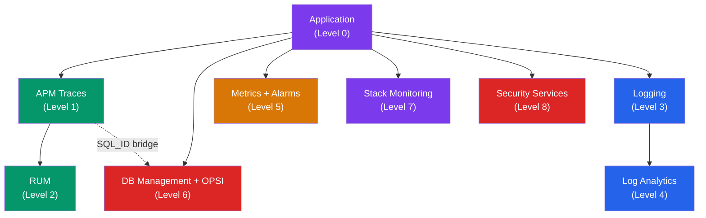

# OCI Observability Add-Ons

Both the Drone Shop and CRM Portal use a **modular observability architecture**. Each OCI service activates independently via environment variables — no code changes required.

## Add-On Matrix

| Add-On | Activation | Drone Shop | CRM Portal |
|--------|-----------|------------|------------|
| **Prometheus** | Always on | `/metrics` | `/metrics` |
| **APM (Traces)** | Env vars | 50+ spans | 8+ spans/req |
| **APM (RUM)** | Env vars | Custom events | Page load tracking |
| **Logging** | Env vars | OCI Logging SDK | OCI Logging SDK |
| **Log Analytics** | Console | `oracleApmTraceId` search | Same |
| **Stack Monitoring** | Console | App topology | App topology |
| **DB Management** | Script | Performance Hub | Performance Hub |
| **Ops Insights** | Script | SQL Warehouse | SQL Warehouse |
| **Monitoring** | Env var | 9 custom metrics + 5 alarms | Custom metrics |
| **Splunk HEC** | Env vars | Security events | Security events |

## Activation Guide

### Level 0: No Observability (App + Database Only)

```bash
# Just the database connection — app runs fully functional
export ORACLE_DSN="myatp_low"
export ORACLE_PASSWORD="<password>"
# Prometheus /metrics is always available (built-in)
```

### Level 1: APM Traces

```bash
export OCI_APM_ENDPOINT="https://<apm-data-upload-endpoint>/20200101/opentelemetry/private/v1/traces"
export OCI_APM_PRIVATE_DATAKEY="<private-data-key>"
```

**What you get:**
- Distributed traces in OCI APM Trace Explorer
- Service topology in OCI APM Topology
- SQL spans with `DbOracleSqlId` for DB Management bridging
- 8+ spans per request with full request lifecycle

### Level 2: Real User Monitoring (RUM)

```bash
export OCI_APM_RUM_ENDPOINT="https://<apm-data-upload-endpoint>"
export OCI_APM_PUBLIC_DATAKEY="<public-data-key>"
```

**What you get:**
- Browser performance monitoring in OCI APM RUM
- Session Explorer with user journey replay
- Custom events (add-to-cart, checkout, search)
- JavaScript error tracking

### Level 3: Structured Logging

```bash
export OCI_LOG_ID="ocid1.log.oc1...."
export OCI_LOG_GROUP_ID="ocid1.loggroup.oc1...."
```

**What you get:**
- Structured JSON logs in OCI Logging
- `oracleApmTraceId` for APM ↔ Log Analytics correlation
- Security event logging with MITRE/OWASP classification
- PII masking (email, phone) before external push

### Level 4: Log Analytics

```
OCI Console → Logging → Log Group → Enable Log Analytics
```

**What you get:**
- Full-text search across application logs
- Saved searches for common patterns
- Cross-service log correlation via `oracleApmTraceId`
- Dashboard widgets for log volume, error rates

### Level 5: Custom Metrics & Alarms

```bash
export OCI_COMPARTMENT_ID="ocid1.compartment.oc1...."
```

Then run:
```bash
COMPARTMENT_ID="$OCI_COMPARTMENT_ID" \
SHOP_PUBLIC_URL="https://shop.${DNS_DOMAIN}" \
./deploy/oci/ensure_monitoring.sh
```

**What you get:**
- 9 custom metrics in OCI Monitoring (health, errors, latency, orders, inventory)
- 5 alarms (error rate, DB latency, health-down, CRM sync stale, low stock)
- OCI Health Checks (HTTP `/ready` every 30s)
- OCI Notifications for alarm delivery

### Level 6: Database Observability

```bash
AUTONOMOUS_DATABASE_ID="ocid1.autonomousdatabase.oc1...." \
./deploy/oci/ensure_db_observability.sh
```

**What you get:**

=== "DB Management"

    - **Performance Hub** — Real-time SQL monitoring, ASH analytics
    - **SQL Monitor** — Per-statement execution plans and stats
    - **AWR Reports** — Historical workload analysis
    - Bridged from APM via `DbOracleSqlId` span attribute

=== "Operations Insights"

    - **SQL Warehouse** — Top SQL aggregation across time
    - **Capacity Planning** — CPU, storage, I/O projections
    - **Fleet Summary** — Multi-database health overview
    - Filter by `MODULE=octo-drone-shop-oke` or `MODULE=enterprise-crm-portal`

### Level 7: Stack Monitoring

```
OCI Console → Stack Monitoring → Create Discovery
→ Select OKE cluster → Discover applications
```

**What you get:**
- Application topology visualization
- Component health monitoring
- Metric correlation across application stack
- Alert rules for component health

### Level 8: Security Services

```bash
# WAF protection rules
LOAD_BALANCER_OCID="<lb-ocid>" ./deploy/oci/ensure_waf.sh

# Cloud Guard
./deploy/oci/ensure_cloud_guard.sh

# Security Zones
./deploy/oci/ensure_security_zones.sh

# Vault
./deploy/oci/ensure_vault.sh
```

**What you get:**
- WAF: SQLi/XSS/CmdInj/PathTraversal block + rate limiting
- Cloud Guard: Security posture monitoring + auto-remediation
- Security Zones: Compliance policy enforcement
- Vault: HSM-backed secret management

## Dependency Graph



!!! tip "Progressive Enablement"
    Start at Level 0 and add observability services as needed. Each level is independent — skip any level that doesn't apply to your use case. The only dependency is that RUM requires APM, and Log Analytics requires Logging.
